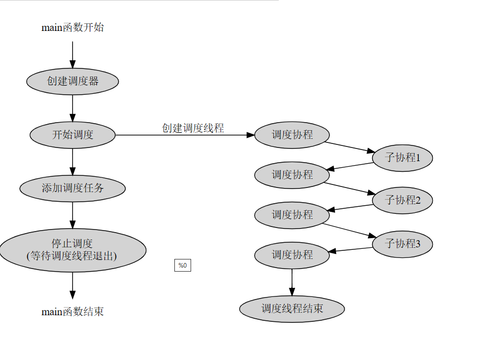
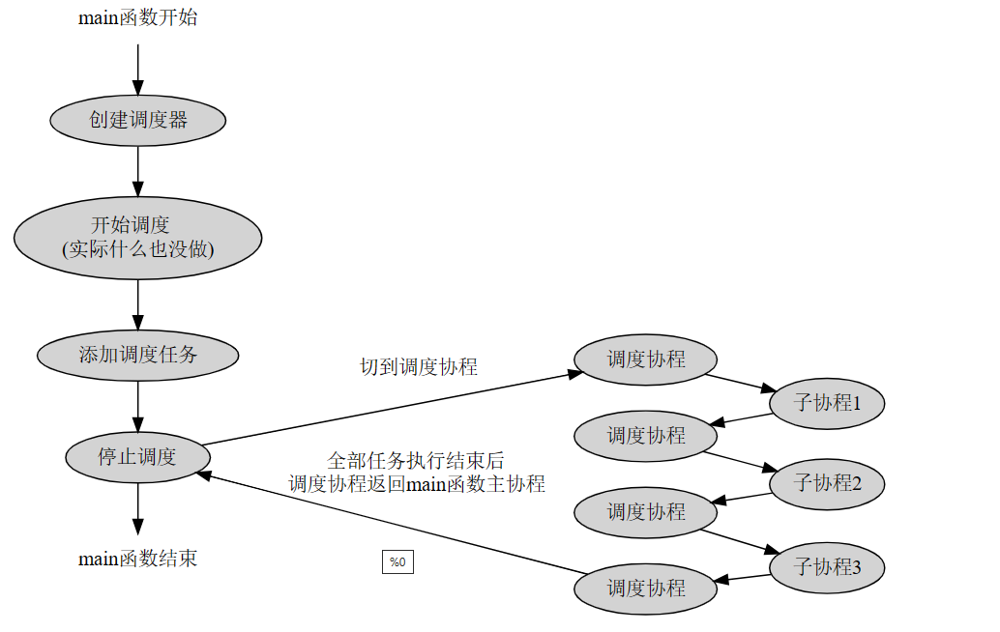
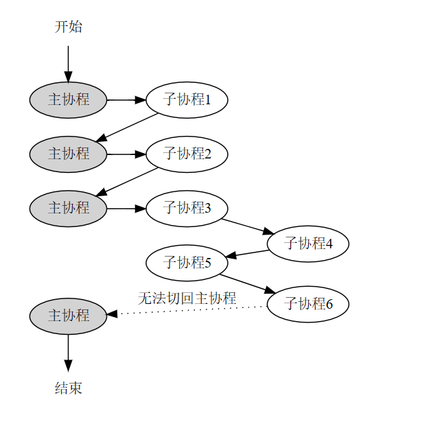
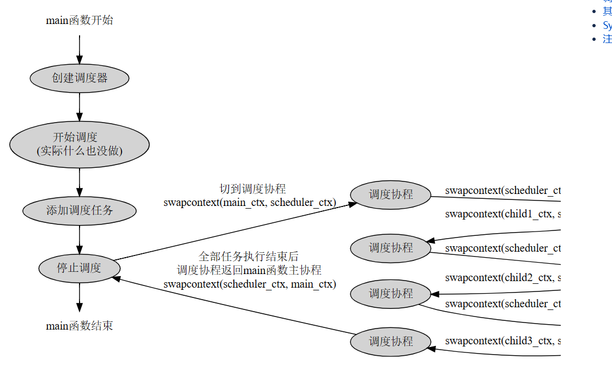

协程调度模块
----
实现了一个N-M的协程调度器，N个线程运行M个协程，协程可以在线程之间进行切换，也可以绑定到指定线程运行。

学习协程调度之前必须完全掌握sylar的协程模块，参考[协程模块](./fiber.md)。

实现协程调度之后，可以解决前一章协程模块中子协程不能运行另一个子协程的缺陷，子协程可以通过向调度器添加调度任务的方式来运行另一个子协程。

协程调度最难理解的地方是当caller线程也参与调度时调度协程和主线程切换的情况，注意对照源码进行理解。
## 协程调度概述
---
当你有很多协程时，如何把这些协程都消耗掉，这就是协程调度。

在前面的协程模块中，对于每个协程，都需要用户手动调用协程的resume方法将协程运行起来，然后等协程运行结束并返回，再运行下一个协程。这种运行协程的方式其实是用户自己在挑选协程执行，相当于用户在充当调度器，显然不够灵活.

引入协程调度后，则可以先创建一个协程调度器，然后把这些要调度的协程传递给调度器，由调度器负责把这些协程一个一个消耗掉。

从某种程度来看，协程调度其实非常简单，简单到用下面的代码就可以实现一个调度器，这个调度器可以添加调度任务，运行调度任务，并且还是完全公平调度的，先添加的任务先执行，后添加的任务后执行。
```CPP
/**
 * @file simple_fiber_scheduler.cc
 * @brief 一个简单的协程调度器实现
 * @version 0.1
 * @date 2021-07-10
 */
 
#include "sylar/sylar.h"
 
/**
 * @brief 简单协程调度类，支持添加调度任务以及运行调度任务
 */
class Scheduler {
public:
    /**
     * @brief 添加协程调度任务
     */
    void schedule(sylar::Fiber::ptr task) {
        m_tasks.push_back(task);
    }
 
    /**
     * @brief 执行调度任务
     */
    void run() {
        sylar::Fiber::ptr task;
        auto it = m_tasks.begin();
 
        while(it != m_tasks.end()) {
            task = *it;
            m_tasks.erase(it++);
            task->resume();
        }
    }
private:
    /// 任务队列
    std::list<sylar::Fiber::ptr> m_tasks;
};
 
void test_fiber(int i) {
    std::cout << "hello world " << i << std::endl;
}
 
int main() {
    /// 初始化当前线程的主协程
    sylar::Fiber::GetThis();
 
    /// 创建调度器
    Scheduler sc;
 
    /// 添加调度任务
    for(auto i = 0; i < 10; i++) {
        sylar::Fiber::ptr fiber(new sylar::Fiber(
            std::bind(test_fiber, i)
        ));
        sc.schedule(fiber);
    }
 
    /// 执行调度任务
    sc.run();
 
    return 0;
}
```
不要觉得上面这个调度器扯淡，除了不支持多线程，sylar的协程调度器和它的设计思路完全相同，甚至，上面的实现可以看成是sylar的协程调度器的一个特例，当sylar的协程调度器只使用main函数所在线程进行调度时，它的工作原理和上面的完全一样，只不过代码看起来更花里胡哨一些。

接下来将从上面这个调度器开始，来分析一些和协程调度器相关的概念。

首先是关于调度任务的定义，对于协程调度器来说，协程当然可以作为调度任务，但实际上，函数也应可以，因为函数也是可执行的对象，调度器应当支持直接调度一个函数。这在代码实现上也很简单，只需要将函数包装成协程即可，协程调度器的实现重点还是以协程为基础。

接下来是多线程，通过前面协程模块的知识我们可以知道，一个线程同一时刻只能运行一个协程，所以，作为协程调度器，势必要用到多线程来提高调度的效率，因为有多个线程就意味着有多个协程可以同时执行，这显然是要好过单线程的。

既然多线程可以提高协程调度的效率，那么，能不能把调度器所在的线程（称为caller线程）也加入进来作为调度线程呢？比如典型地，在main函数中定义的调度器，能不能把main函数所在的线程也用来执行调度任务呢？答案是肯定的，在实现相同调度能力的情况下（指能够同时调度的协程数量），线程数越小，线程切换的开销也就越小，效率就更高一些，所以，调度器所在的线程，也应该支持用来执行调度任务。甚至，调度器完全可以不创建新的线程，而只使用caller线程来进行协程调度，比如只使用main函数所在的线程来进行协程调度。

接下来是调度器如何运行，这里可以简单地认为，调度器创建后，内部首先会创建一个调度线程池，调度开始后，所有调度线程按顺序从任务队列里取任务执行，调度线程数越多，能够同时调度的任务也就越多，当所有任务都调度完后，调度线程就停下来等新的任务进来。

接下来是添加调度任务，添加调度任务的本质就是往调度器的任务队列里塞任务，但是，只添加调度任务是不够的，还应该有一种方式用于通知调度线程有新的任务加进来了，因为调度线程并不一定知道有新任务进来了。当然调度线程也可以不停地轮询有没有新任务，但是这样CPU占用率会很高。

接下来是调度器的停止。调度器应该支持停止调度的功能，以便回收调度线程的资源，只有当所有的调度线程都结束后，调度器才算真正停止。


通过上面的描述，一个协程调度器的大概设计也就出炉了：

调度器内部维护一个任务队列和一个调度线程池。开始调度后，线程池从任务队列里按顺序取任务执行。调度线程可以包含caller线程。当全部任务都执行完了，线程池停止调度，等新的任务进来。添加新任务后，通知线程池有新的任务进来了，线程池重新开始运行调度。停止调度时，各调度线程退出，调度器停止工作。

## sylar协程调度模块设计
---
sylar的协程调度模块支持多线程，支持使用caller线程进行调度，支持添加函数或协程作为调度对象，并且支持将函数或协程绑定到一个具体的线程上执行。

首先是协程调度器的初始化。sylar的协程调度器在初始化时支持传入线程数和一个布尔型的use_caller参数，表示是否使用caller线程。在使用caller线程的情况下，线程数自动减一，并且调度器内部会初始化一个属于caller线程的调度协程并保存起来（比如，在main函数中创建的调度器，如果use_caller为true，那调度器会初始化一个属于main函数线程的调度协程）。

调度器创建好后，即可调用调度器的schedule方法向调度器添加调度任务，但此时调度器并不会立刻执行这些任务，而是将它们保存到内部的一个任务队列中。

接下来是调用start方法启动调度。start方法调用后会创建调度线程池，线程数量由初始化时的线程数和use_caller确定。调度线程一旦创建，就会立刻从任务队列里取任务执行。比较特殊的一点是，如果初始化时指定线程数为1且use_caller为true，那么start方法什么也不做，因为不需要创建新线程用于调度。并且，由于没有创建新的调度线程，那只能由caller线程的调度协程来负责调度协程，而caller线程的调度协程的执行时机与start方法并不在同一个地方。

接下来是调度协程，对应run方法。调度协程负责从调度器的任务队列中取任务执行。取出的任务即子协程，这里调度协程和子协程的切换模型即为前一章介绍的非对称模型，每个子协程执行完后都必须返回调度协程，由调度协程重新从任务队列中取新的协程并执行。如果任务队列空了，那么调度协程会切换到一个idle协程，这个idle协程什么也不做，等有新任务进来时，idle协程才会退出并回到调度协程，重新开始下一轮调度。

在非caller线程里，调度协程就是调度线程的主线程，但在caller线程里，调度协程并不是caller线程的主协程，而是相当于caller线程的子协程，这在协程切换时会有大麻烦（这点是sylar协程调度模块最难理解的地方），如何处理这个问题将在下面的章节专门进行讨论。

接下来是添加调度任务，对应schedule方法，这个方法支持传入协程或函数，并且支持一个线程号参数，表示是否将这个协程或函数绑定到一个具体的线程上执行。如果任务队列为空，那么在添加任务之后，要调用一次tickle方法以通知各调度线程的调度协程有新任务来了。

在执行调度任务时，还可以通过调度器的GetThis()方法获取到当前调度器，再通过schedule方法继续添加新的任务，这就变相实现了在子协程中创建并运行新的子协程的功能。

接下来是调度器的停止。调度器的停止行为要分两种情况讨论，首先是use_caller为false的情况，这种情况下，由于没有使用caller线程进行调度，那么只需要简单地等各个调度线程的调度协程退出就行了。如果use_caller为true，表示caller线程也要参于调度，这时，调度器初始化时记录的属于caller线程的调度协程就要起作用了，在调度器停止前，应该让这个caller线程的调度协程也运行一次，让caller线程完成调度工作后再退出。如果调度器只使用了caller线程进行调度，那么所有的调度任务要在调度器停止时才会被调度。
## 调度协程切换问题
----
这里分两种典型情况来讨论一下调度协程的切换情况，其他情况可以看成以下两种情况的组合，原理是一样的。

1. 线程数为1，且use_caller为true，对应只使用main函数线程进行协程调度的情况。

2. 线程数为1，且use_caller为false，对应额外创建一个线程进行协程调度、main函数线程不参与调度的情况。


这里先说情况2。情况2比较好理解，因为有单独的线程用于协程调度，那只需要让新线程的入口函数作为调度协程，从任务队列里取任务执行就行了，main函数与调度协程完全不相关，main函数只需要向调度器添加任务，然后在适当的时机停止调度器即可。当调度器停止时，main函数要等待调度线程结束后再退出，参考下面的图示：

情况1则比较复杂，因为没有额外的线程进行协程调度，那只能用main函数所在的线程来进行调度，而梳理一下main函数线程要运行的协程，会发现有以下三类协程：

1.  main函数对应的主协程

2. 调度协程

3. 待调度的任务协程

在main函数线程里这三类协程运行的顺序是这样的：

1. main函数主协程运行，创建调度器

2. 仍然是main函数主协程运行，向调度器添加一些调度任务

3. 开始协程调度，main函数主协程让出执行权，切换到调度协程，调度协程从任务队列里按顺序执行所有的任务

4. 每次执行一个任务，调度协程都要让出执行权，再切到该任务的协程里去执行，任务执行结束后，还要再切回调度协程，继续下一个任务的调度

5. 所有任务都执行完后，调度协程还要让出执行权并切回main函数主协程，以保证程序能顺利结束。


上面的过程也可以总结为：main函数先攒下一波协程，然后切到调度协程里去执行，等把这些协程都消耗完后，再从调度协程切回来，像下面这样：

从这个图看，是不是本文开头的简单调度器实现有几分神似？
然而，回顾一下前面协程模块就会发现，上面这种协程切换实际是有问题的，参考下面这张图：

在非对称协程里，子协程只能和线程主协程切换，而不能和另一个子协程切换。在上面的情况1中，线程主协程是main函数对应的协程，另外的两类协程，也就是调度协程和任务协程，都是子协程，也就是说，调度协程不能直接和任务协程切换，一旦切换，程序的main函数协程就跑飞了。

解决单线程环境下caller线程主协程-调度协程-任务协程之间的上下文切换，是sylar协程调度实现的关键。

其实，子协程和子协程切换导致线程主协程跑飞的关键原因在于，每个线程只有两个线程局部变量用于保存当前的协程上下文信息。也就是说线程任何时候都最多只能知道两个协程的上下文，其中一个是当前正在运行协程的上下文，另一个是线程主协程的上下文，如果子协程和子协程切换，那这两个上下文都会变成子协程的上下文，线程主协程的上下文丢失了，程序也就跑飞了。如果不改变这种局部，就只能线程主协程去充当调度协程，这就相当于又回到了让用户充当调度器的情况。

那么，如何改变这种情况呢？其实非常简单，只需要给每个线程增加一个线程局部变量用于保存调度协程的上下文就可以了，这样，每个线程可以同时保存三个协程的上下文，一个是当前正在执行的协程上下文，另一个是线程主协程的上下文，最后一个是调度协程的上下文。有了这三个上下文，协程就可以根据自己的身份来选择和每次和哪个协程进行交换，具体操作如下：

1. 给协程类增加一个bool类型的成员m_runInScheduler，用于记录该协程是否通过调度器来运行。

2. 创建协程时，根据协程的身份指定对应的协程类型，具体来说，只有想让调度器调度的协程的m_runInScheduler值为true，线程主协程和线程调度协程的m_runInScheduler都为false。

3. resume一个协程时，如果如果这个协程的m_runInScheduler值为true，表示这个协程参与调度器调度，那它应该和三个线程局部变量中的调度协程上下文进行切换，同理，在协程yield时，也应该恢复调度协程的上下文，表示从子协程切换回调度协程；

4. 如果协程的m_runInScheduler值为false，表示这个协程不参与调度器调度，那么在resume协程时，直接和线程主协程切换就可以了，yield也一样，应该恢复线程主协程的上下文。m_runInScheduler值为false的协程上下文切换完全和调度协程无关，可以脱离调度器使用。

经过上面的改造了，就可以解决单线程环境下caller线程主协程-调度协程-任务协程之间的上下文切换问题了，假设caller线程主协程的上下文为main_ctx，调度协程的上下文为scheduler_ctx，任务协程上下文为child_ctx，那么单线程下的协程切换将像下面这样（图片显示不全的话请缩小显示比例）：

## 其他情况的讨论
----
讨论几种情况：

1.  调度器的退出问题。调度器内部有一个协程任务队列，调度器调度的实质就是内部的线程池从这个任务队列拿任务并执行，那么，停止调度时，如果任务队列还有任务剩余，要怎么处理？这里可以简化处理，强制规定只有所有的任务都完成调度时，调度器才可以退出，如果有一个任务没有执行完，那调度器就不能退出。


2. 任务协程执行过程中主动调用yield让出了执行权，调度器要怎么处理？半路yield的协程显然并没有执行完，一种处理方法是调度器来帮协程擦屁股，在检测到协程从resume返回时，如果状态仍为READY，那么就把协程重新扔回任务列，使其可以再次被调度，这样保证一个协程可以执行结束。但这种策略是画蛇添足的，从生活经验的角度来看，一个成熟的协程肯定要学会自我管理，既然你自己yield了，那么你就应该自己管理好自己，而不是让别人来帮你，这样才算是一个成熟的协程。对于主动yield的协程，我们的策略是，调度器直接认为这个任务已经调度完了，不再将其加入任务队列。如果协程想完整地运行，那么在yield之前，协程必须先把自己再扔回当前调度器的任务队列里，然后再执行yield，这样才能确保后面还会再来调度这个协程。

这里规定了一点，协程在主动执行yield前，必须先将自己重新添加到调度器的任务队列中。如果协程不顾后果地执行yield，最后的后果就是协程将永远无法再被执行，也就是所说的逃逸状态。（sylar的处理方法比较折衷一些，sylar定义了两种yield操作，一种是yield to ready，这种yield调度器会再次将协程加入任务队列并等待调度，另一种是yield to hold，这种yield调度器不会再将协程加入任务队列，协程在yield之前必须自己先将自己加入到协程的调度队列中，否则协程就处于逃逸状态。再说一点，sylar定义的yield to ready，在整个sylar框架内一次都没用到，看来sylar也同意，一个成熟的协程要学会自我管理。）


3. 只使用调度器所在的线程进行调度，典型的就是main函数中定义调度器并且只使用main函数线程执行调度任务。这种场景下，可以认为是main函数先攒下一波协程，然后切到调度协程，把这些协程消耗完后再从调度协程切回main函数协程。每个协程在运行时也可以继续创建新的协程并加入调度。如果所有协程都调度完了，并且没有创建新的调度任务，那么下一步就是讨论idle该如何处理。


4. idle如何处理，也就是当调度器没有协程可调度时，调度协程该怎么办。直觉上来看这里应该有一些同步手段，比如，没有调度任务时，调度协程阻塞住，比如阻塞在一个idle协程上，等待新任务加入后退出idle协程，恢复调度。然而这种方案是无法实现的，因为每个线程同一时间只能有一个协程在执行，如果调度线程阻塞在idle协程上，那么除非idle协程自行让出执行权，否则其他的协程都得不到执行，这里就造成了一个先有鸡还是先有蛋的问题：只有创建新任务idle协程才会退出，只有idle协程退出才能创建新任务。为了解决这个问题，sylar采取了一个简单粗暴的办法，如果任务队列空了，调度协程会不停地检测任务队列，看有没有新任务，俗称忙等待，CPU使用率爆表。这点可以从sylar的源码上发现，一是Scheduler的tickle函数什么也不做，因为根本不需要通知调度线程是否有新任务，二是idle协程在协程调度器未停止的情况下只会yield to hold，而调度协程又会将idle协程重新swapIn，相当于idle啥也不做直接返回。这个问题在sylar框架内无解，只有一种方法可以规避掉，那就是设置autostop标志，这个标志会使得调度器在调度完所有任务后自动退出。在后续的IOManager中，上面的问题会得到一定的改善，并且tickle和idle可以实现得更加巧妙一些，以应对IO事件。


5. 只有main函数线程参与调度时的调度执行时机。前面说过，当只有main函数线程参与调度时，可以认为是主线程先攒下一波协程，然后切到调度协程开始调度这些协程，等所有的协程都调度完了，调度协程进idle状态，这个状态下调度器只能执行忙等待，啥也做不了。这也就是说，主线程main函数一旦开启了协程调度，就无法回头了，位于开始调度点之后的代码都执行不到。对于这个问题，sylar把调度器的开始点放在了stop方法中，也就是，调度开始即结束，干完活就下班。IOManager也是类似，除了可以调用stop方法外，IOManager类的析构函数也有一个stop方法，可以保证所有的任务都会被调度到。


6.  额外创建了调度线程时的调度执行时机。如果不额外创建线程，也就是线程数为1并且use caller，那所有的调度任务都在stop()时才会进行调度。但如果额外创建了线程，那么，在添加完调度任务之后任务马上就可以在另一个线程中调度执行。归纳起来，如果只使用caller线程进行调度，那所有的任务协程都在stop之后排队调度，如果有额外线程，那任务协程在刚添加到任务队列时就可以得到调度。


7. 协程中的异常要怎么处理，子协程抛出了异常该怎么办？这点其实非常好办，类比一下线程即可，你会在线程外面处理线程抛出的异常吗？答案是不会，所以协程抛出的异常我们也不处理，直接让程序按默认的处理方式来处理即可。一个成熟的协程应该自己处理掉自己的异常，而不是让调度器来帮忙。顺便说一下，sylar的协程调度器处理了协程抛出的异常，并且给异常结束的协程设置了一个EXCEPT状态，这看似贴心，但从长远的角度来看，其实是非常不利于协程的健康成长的。


8. 关于协程调度器的优雅停止。sylar停止调度器的策略如下：

    - 设置m_stopping标志，该标志表示正在停止
    - 检测是否使用了caller线程进行调度，如果使用了caller线程进行调度，那要保证stop方法是由caller线程发起的
    - 通知其他调度线程的调度协程退出调度
    - 通知当前线程的调度协程退出调度
    - 如果使用了caller线程进行调度，那执行一次caller线程的调度协程（只使用caller线程时的协程调度全仰仗这个操作）
    - 等caller线程的调度协程返回
    - 等所有调度线程结束

## Sylar协程调度模块实现
---
首先是对协程模块的改造，增加m_runInScheduler成员，表示当前协程是否参与调度器调度，在协程的resume和yield时，根据协程的运行环境确定是和线程主协程进行交换还是和调度协程进行交换：
```CPP
Fiber::Fiber(std::function<void()> cb, size_t stacksize, bool run_in_scheduler)
    : m_id(s_fiber_id++)
    , m_cb(cb)
    , m_runInScheduler(run_in_scheduler) {
    ++s_fiber_count;
    m_stacksize = stacksize ? stacksize : g_fiber_stack_size->getValue();
    m_stack     = StackAllocator::Alloc(m_stacksize);
 
    if (getcontext(&m_ctx)) {
        SYLAR_ASSERT2(false, "getcontext");
    }
 
    m_ctx.uc_link          = nullptr;
    m_ctx.uc_stack.ss_sp   = m_stack;
    m_ctx.uc_stack.ss_size = m_stacksize;
 
    makecontext(&m_ctx, &Fiber::MainFunc, 0);
 
    SYLAR_LOG_DEBUG(g_logger) << "Fiber::Fiber() id = " << m_id;
}
 
void Fiber::resume() {
    SYLAR_ASSERT(m_state != TERM && m_state != RUNNING);
    SetThis(this);
    m_state = RUNNING;
 
    // 如果协程参与调度器调度，那么应该和调度器的主协程进行swap，而不是线程主协程
    if (m_runInScheduler) {
        if (swapcontext(&(Scheduler::GetMainFiber()->m_ctx), &m_ctx)) {
            SYLAR_ASSERT2(false, "swapcontext");
        }
    } else {
        if (swapcontext(&(t_thread_fiber->m_ctx), &m_ctx)) {
            SYLAR_ASSERT2(false, "swapcontext");
        }
    }
}
 
void Fiber::yield() {
    /// 协程运行完之后会自动yield一次，用于回到主协程，此时状态已为结束状态
    SYLAR_ASSERT(m_state == RUNNING || m_state == TERM);
    SetThis(t_thread_fiber.get());
    if (m_state != TERM) {
        m_state = READY;
    }
 
    // 如果协程参与调度器调度，那么应该和调度器的主协程进行swap，而不是线程主协程
    if (m_runInScheduler) {
        if (swapcontext(&m_ctx, &(Scheduler::GetMainFiber()->m_ctx))) {
            SYLAR_ASSERT2(false, "swapcontext");
        }
    } else {
        if (swapcontext(&m_ctx, &(t_thread_fiber->m_ctx))) {
            SYLAR_ASSERT2(false, "swapcontext");
        }
    }
}
```
然后是对调度任务的定义，如下，这里任务类型可以是协程/函数二选一，并且可指定调度线程。
```CPP
/**
 * @brief 调度任务，协程/函数二选一，可指定在哪个线程上调度
 */
struct ScheduleTask {
    Fiber::ptr fiber;
    std::function<void()> cb;
    int thread;
 
    ScheduleTask(Fiber::ptr f, int thr) {
        fiber  = f;
        thread = thr;
    }
    ScheduleTask(Fiber::ptr *f, int thr) {
        fiber.swap(*f);
        thread = thr;
    }
    ScheduleTask(std::function<void()> f, int thr) {
        cb     = f;
        thread = thr;
    }
    ScheduleTask() { thread = -1; }
 
    void reset() {
        fiber  = nullptr;
        cb     = nullptr;
        thread = -1;
    }
};
```
接下来是调度器的成员变量，包括以下成员：
```CPP
/// 协程调度器名称
std::string m_name;
/// 互斥锁
MutexType m_mutex;
/// 线程池
std::vector<Thread::ptr> m_threads;
/// 任务队列
std::list<ScheduleTask> m_tasks;
/// 线程池的线程ID数组
std::vector<int> m_threadIds;
/// 工作线程数量，不包含use_caller的主线程
size_t m_threadCount = 0;
/// 活跃线程数
std::atomic<size_t> m_activeThreadCount = {0};
/// idle线程数
std::atomic<size_t> m_idleThreadCount = {0};
 
/// 是否use caller
bool m_useCaller;
/// use_caller为true时，调度器所在线程的调度协程
Fiber::ptr m_rootFiber;
/// use_caller为true时，调度器所在线程的id
int m_rootThread = 0;
 
/// 是否正在停止
bool m_stopping = false;
```
接下来是协程调度模块的全局变量和线程局部变量，这里只有以下两个线程局部变量：
```CPP
/// 当前线程的调度器，同一个调度器下的所有线程指同同一个调度器实例
static thread_local Scheduler *t_scheduler = nullptr;
/// 当前线程的调度协程，每个线程都独有一份，包括caller线程
static thread_local Fiber *t_scheduler_fiber = nullptr;
```
t_scheduler_fiber保存当前线程的调度协程，加上Fiber模块的t_fiber和t_thread_fiber，每个线程总共可以记录三个协程的上下文信息。


接下来是调度器的构造方法，如下：
```CPP
/**
 * @brief 创建调度器
 * @param[in] threads 线程数
 * @param[in] use_caller 是否将当前线程也作为调度线程
 * @param[in] name 名称
 */
Scheduler::Scheduler(size_t threads, bool use_caller, const std::string &name) {
    SYLAR_ASSERT(threads > 0);
 
    m_useCaller = use_caller;
    m_name      = name;
 
    if (use_caller) {
        --threads;
        sylar::Fiber::GetThis();
        SYLAR_ASSERT(GetThis() == nullptr);
        t_scheduler = this;
 
        /**
         * 在user_caller为true的情况下，初始化caller线程的调度协程
         * caller线程的调度协程不会被调度器调度，而且，caller线程的调度协程停止时，应该返回caller线程的主协程
         */
        m_rootFiber.reset(new Fiber(std::bind(&Scheduler::run, this), 0, false));
 
        sylar::Thread::SetName(m_name);
        t_scheduler_fiber = m_rootFiber.get();
        m_rootThread      = sylar::GetThreadId();
        m_threadIds.push_back(m_rootThread);
    } else {
        m_rootThread = -1;
    }
    m_threadCount = threads;
}
 
Scheduler *Scheduler::GetThis() {
    return t_scheduler;
}
```
接下来是两个get方法，用于获取当前线程的调度器和调度协程，这两个都是静态方法：
```CPP
Scheduler *Scheduler::GetThis() {
    return t_scheduler;
}
 
Fiber *Scheduler::GetMainFiber() {
    return t_scheduler_fiber;
}
```
接下来是协程调度器的start方法实现，这里主要初始化调度线程池，如果只使用caller线程进行调度，那这个方法啥也不做：
```CPP
void Scheduler::start() {
    SYLAR_LOG_DEBUG(g_logger) << "start";
    MutexType::Lock lock(m_mutex);
    if (m_stopping) {
        SYLAR_LOG_ERROR(g_logger) << "Scheduler is stopped";
        return;
    }
    SYLAR_ASSERT(m_threads.empty());
    m_threads.resize(m_threadCount);
    for (size_t i = 0; i < m_threadCount; i++) {
        m_threads[i].reset(new Thread(std::bind(&Scheduler::run, this),
                                      m_name + "_" + std::to_string(i)));
        m_threadIds.push_back(m_threads[i]->getId());
    }
}
```
接下来判断调度器是否已经停止的方法，只有当所有的任务都被执行完了，调度器才可以停止：
```CPP
bool Scheduler::stopping() {
    MutexType::Lock lock(m_mutex);
    return m_stopping && m_tasks.empty() && m_activeThreadCount == 0;
}
```
接下来是调度器的tickle和idle实现，可以看到这两个方法并没有什么卵用：
```CPP
void Scheduler::tickle() {
    SYLAR_LOG_DEBUG(g_logger) << "ticlke";
}
 
void Scheduler::idle() {
    SYLAR_LOG_DEBUG(g_logger) << "idle";
    while (!stopping()) {
        sylar::Fiber::GetThis()->yield();
    }
}
```
接下来是调度协程的实现，内部有一个while(true)循环，不停地从任务队列取任务并执行，由于Fiber类改造过，每个被调度器执行的协程在结束时都会回到调度协程，所以这里不用担心跑飞问题，当任务队列为空时，代码会进idle协程，但idle协程啥也不做直接就yield了，状态还是READY状态，所以这里其实就是个忙等待，CPU占用率爆炸，只有当调度器检测到停止标志时，idle协程才会真正结束，调度协程也会检测到idle协程状态为TERM，并且随之退出整个调度协程。这里还可以看出一点，对于一个任务协程，只要其从resume中返回了，那不管它的状态是TERM还是READY，调度器都不会自动将其再次加入调度，因为前面说过，一个成熟的协程是要学会自我管理的。
```CPP
void Scheduler::run() {
    SYLAR_LOG_DEBUG(g_logger) << "run";
    setThis();
    if (sylar::GetThreadId() != m_rootThread) {
        t_scheduler_fiber = sylar::Fiber::GetThis().get();
    }
 
    Fiber::ptr idle_fiber(new Fiber(std::bind(&Scheduler::idle, this)));
    Fiber::ptr cb_fiber;
 
    ScheduleTask task;
    while (true) {
        task.reset();
        bool tickle_me = false; // 是否tickle其他线程进行任务调度
        {
            MutexType::Lock lock(m_mutex);
            auto it = m_tasks.begin();
            // 遍历所有调度任务
            while (it != m_tasks.end()) {
                if (it->thread != -1 && it->thread != sylar::GetThreadId()) {
                    // 指定了调度线程，但不是在当前线程上调度，标记一下需要通知其他线程进行调度，然后跳过这个任务，继续下一个
                    ++it;
                    tickle_me = true;
                    continue;
                }
 
                // 找到一个未指定线程，或是指定了当前线程的任务
                SYLAR_ASSERT(it->fiber || it->cb);
                if (it->fiber) {
                    // 任务队列时的协程一定是READY状态，谁会把RUNNING或TERM状态的协程加入调度呢？
                    SYLAR_ASSERT(it->fiber->getState() == Fiber::READY);
                }
                // 当前调度线程找到一个任务，准备开始调度，将其从任务队列中剔除，活动线程数加1
                task = *it;
                m_tasks.erase(it++);
                ++m_activeThreadCount;
                break;
            }
            // 当前线程拿完一个任务后，发现任务队列还有剩余，那么tickle一下其他线程
            tickle_me |= (it != m_tasks.end());
        }
 
        if (tickle_me) {
            tickle();
        }
 
        if (task.fiber) {
            // resume协程，resume返回时，协程要么执行完了，要么半路yield了，总之这个任务就算完成了，活跃线程数减一
            task.fiber->resume();
            --m_activeThreadCount;
            task.reset();
        } else if (task.cb) {
            if (cb_fiber) {
                cb_fiber->reset(task.cb);
            } else {
                cb_fiber.reset(new Fiber(task.cb));
            }
            task.reset();
            cb_fiber->resume();
            --m_activeThreadCount;
            cb_fiber.reset();
        } else {
            // 进到这个分支情况一定是任务队列空了，调度idle协程即可
            if (idle_fiber->getState() == Fiber::TERM) {
                // 如果调度器没有调度任务，那么idle协程会不停地resume/yield，不会结束，如果idle协程结束了，那一定是调度器停止了
                SYLAR_LOG_DEBUG(g_logger) << "idle fiber term";
                break;
            }
            ++m_idleThreadCount;
            idle_fiber->resume();
            --m_idleThreadCount;
        }
    }
    SYLAR_LOG_DEBUG(g_logger) << "Scheduler::run() exit";
}
```
最后是调度器的stop方法，在使用了caller线程的情况下，调度器依赖stop方法来执行caller线程的调度协程，如果调度器只使用了caller线程来调度，那调度器真正开始执行调度的位置就是这个stop方法。
```CPP
void Scheduler::stop() {
    SYLAR_LOG_DEBUG(g_logger) << "stop";
    if (stopping()) {
        return;
    }
    m_stopping = true;
 
    /// 如果use caller，那只能由caller线程发起stop
    if (m_useCaller) {
        SYLAR_ASSERT(GetThis() == this);
    } else {
        SYLAR_ASSERT(GetThis() != this);
    }
 
    for (size_t i = 0; i < m_threadCount; i++) {
        tickle();
    }
 
    if (m_rootFiber) {
        tickle();
    }
 
    /// 在use caller情况下，调度器协程结束时，应该返回caller协程
    if (m_rootFiber) {
        m_rootFiber->resume();
        SYLAR_LOG_DEBUG(g_logger) << "m_rootFiber end";
    }
 
    std::vector<Thread::ptr> thrs;
    {
        MutexType::Lock lock(m_mutex);
        thrs.swap(m_threads);
    }
    for (auto &i : thrs) {
        i->join();
    }
}
```

## 注意事项
sylar的协程调度模块因为存任务队列空闲时调度线程忙等待的问题，所以实际上并不实用，真正实用的是后面基于Scheduler实现的IOManager。由于任务队列的任务是按顺序执行的，如果有一个任务占用了比较长时间，那其他任务的执行会受到影响，如果任务执行的是像while(1)这样的循环，那线程数不够时，后面的任务都不会得到执行。另外，当前还没有实现hook功能，像sleep和等待IO就绪这样的操作也会阻塞协程调度。