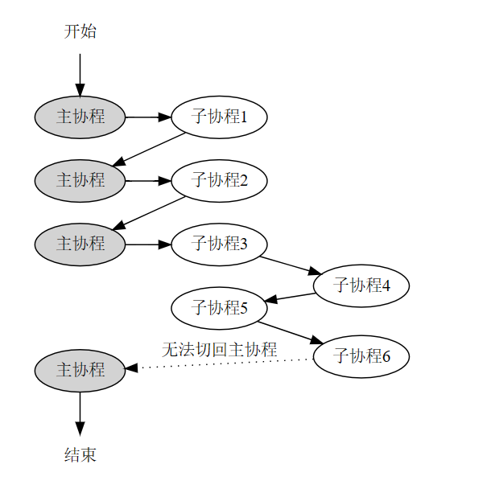

协程模块
---
基于ucontext_t实现非对称协程。本章描述的内容只和协程有关，不涉及协程调度。

## 协程概述
[什么是协程](https://www.jianshu.com/p/a0efeee9ba63)
最简单的理解，可以将协程当成一种看起来花里胡哨，并且使用起来也花里胡哨的函数。

每个协程在创建时都会指定一个入口函数，这点可以类比线程。协程的本质就是函数和函数运行状态的组合 。

协程和函数的不同之处是，函数一旦被调用，只能从头开始执行，直到函数执行结束退出，而协程则可以执行到一半就退出（称为yield），但此时协程并未真正结束，只是暂时让出CPU执行权，在后面适当的时机协程可以重新恢复运行（称为resume），在这段时间里其他的协程可以获得CPU并运行，所以协程也称为轻量级线程。

协程能够半路yield、再重新resume的关键是协程存储了函数在yield时间点的执行状态，这个状态称为协程上下文。协程上下文包含了函数在当前执行状态下的全部CPU寄存器的值，这些寄存器值记录了函数栈帧、代码的执行位置等信息，如果将这些寄存器的值重新设置给CPU，就相当于重新恢复了函数的运行。在Linux系统里这个上下文用ucontext_t结构体来表示，通getcontext()来获取。

搞清楚协程和线程的区别。协程虽然被称为轻量级线程，但在单线程内，协程并不能并发执行，只能是一个协程结束或yield后，再执行另一个协程，而线程则是可以真正并发执行的。其实这点也好理解，毕竟协程只是以一种花里胡哨的方式去运行一个函数，不管实现得如何巧妙，也不可能在单线程里做到同时运行两个函数，否则还要多线程有何用？

因为单线程下协程并不是并发执行，而是顺序执行的，所以不要在协程里使用线程级别的锁来做协程同步，比如pthread_mutex_t。如果一个协程在持有锁之后让出执行，那么同线程的其他任何协程一旦尝试再次持有这个锁，整个线程就锁死了，这和单线程环境下，连续两次对同一个锁进行加锁导致的死锁道理完全一样。

同样是单线程环境下，协程的yield和resume一定是同步进行的，一个协程的yield，必然对应另一个协程的resume，因为线程不可能没有执行主体。并且，协程的yield和resume是完全由应用程序来控制的。与线程不同，线程创建之后，线程的运行和调度也是由操作系统自动完成的，但协程创建后，协程的运行和调度都要由应用程序来完成，就和调用函数一样，所以协程也被称为用户态线程。

所谓创建协程，其实就是把一个函数包装成一个协程对象，然后再用协程的方式把这个函数跑起来；所谓协程调度，其实就是创建一批的协程对象，然后再创建一个调度协程，通过调度协程把这些协程对象一个一个消化掉（协程可以在被调度时继续向调度器添加新的调度任务）；所谓IO协程调度，其实就是在调度协程时，如果发现这个协程在等待IO就绪，那就先让这个协程让出执行权，等对应的IO就绪后再重新恢复这个协程的运行；所谓定时器，就是给调度协程预设一个协程对象，等定时时间到了就恢复预设的协程对象。

## ucontext_t接口
sylar的协程模块基于ucontext_t实现，在学习之前，必须对ucontext_t和ucontext_t的操作函数非常熟悉。关于ucontext_t的定义和相关的接口如下：
```CPP
// 上下文结构体定义
// 这个结构体是平台相关的，因为不同平台的寄存器不一样
// 下面列出的是所有平台都至少会包含的4个成员
typedef struct ucontext_t {
    // 当前上下文结束后，下一个激活的上下文对象的指针，只在当前上下文是由makecontext创建时有效
    struct ucontext_t *uc_link;
    // 当前上下文的信号屏蔽掩码
    sigset_t          uc_sigmask;
    // 当前上下文使用的栈内存空间，只在当前上下文是由makecontext创建时有效
    stack_t           uc_stack;
    // 平台相关的上下文具体内容，包含寄存器的值
    mcontext_t        uc_mcontext;
    ...
} ucontext_t;
 
// 获取当前的上下文
int getcontext(ucontext_t *ucp);
 
// 恢复ucp指向的上下文，这个函数不会返回，而是会跳转到ucp上下文对应的函数中执行，相当于变相调用了函数
int setcontext(const ucontext_t *ucp);
 
// 修改由getcontext获取到的上下文指针ucp，将其与一个函数func进行绑定，支持指定func运行时的参数，
// 在调用makecontext之前，必须手动给ucp分配一段内存空间，存储在ucp->uc_stack中，这段内存空间将作为func函数运行时的栈空间，
// 同时也可以指定ucp->uc_link，表示函数运行结束后恢复uc_link指向的上下文，
// 如果不赋值uc_link，那func函数结束时必须调用setcontext或swapcontext以重新指定一个有效的上下文，否则程序就跑飞了
// makecontext执行完后，ucp就与函数func绑定了，调用setcontext或swapcontext激活ucp时，func就会被运行
void makecontext(ucontext_t *ucp, void (*func)(), int argc, ...);
 
// 恢复ucp指向的上下文，同时将当前的上下文存储到oucp中，
// 和setcontext一样，swapcontext也不会返回，而是会跳转到ucp上下文对应的函数中执行，相当于调用了函数
// swapcontext是sylar非对称协程实现的关键，线程主协程和子协程用这个接口进行上下文切换
int swapcontext(ucontext_t *oucp, const ucontext_t *ucp);
```
ucontext_t的示例代码可参考：https://github.com/zhongluqiang/playground/tree/main/examples/ucontext，这里不再详细介绍。

## sylar协程模块设计
sylar使用非对称协程模型，也就是子协程只能和线程主协程切换，而不能和另一个子协程切换，并且在程序结束时，一定要再切回主协程，以保证程序能正常结束，像下面这样：

关于协程模型和什么是对称与非对称协程可参考下面的链接：
[C++ 协程的近况、设计与实现中的细节和决策](https://www.jianshu.com/p/837bb161793a)
[协程学习（对称和非对称）](https://zhuanlan.zhihu.com/p/363775637)
从网上的参考资料来看，相对于对称协程，非对称协程具有代码实现简单的特点。

在对称协程中，子协程可以直接和子协程切换，也就是说每个协程不仅要运行自己的入口函数代码，还要负责选出下一个合适的协程进行切换，相当于每个协程都要充当调度器的角色，这样程序设计起来会比较麻烦，并且程序的控制流也会变得复杂和难以管理。而在非对称协程中，可以借助专门的调度器来负责调度协程，每个协程只需要运行自己的入口函数，然后结束时将运行权交回给调度器，由调度器来选出下一个要执行的协程即可。

非对称协程的行为与函数类似，因为函数在运行结束后也总是会返回调用者。

虽然目前还没有涉及到协程调度，但这里其实可以将线程的主协程想像成线程的调度协程，每个子协程执行完了，都必须切回线程主协程，由主协程负责选出下一个要执行的子协程。如果子协程可以和子协程切换，那就相当于变相赋予了子协程调度的权利，这在非对称协程里是不允许的。

sylar借助了线程局部变量的功能来实现协程模块。线程局部变量与全局变量类似，不同之处在于声明的线程局部变量在每个线程都独有一份，而全局变量是全部线程共享一份。

sylar使用线程局部变量（C++11 thread_local变量）来保存协程上下文对象，这点很好理解，因为协程是在线程里运行的，不同线程的协程相互不影响，每个线程都要独自处理当前线程的协程切换问题。

对于每个线程的协程上下文，sylar设计了两个线程局部变量来存储上下文信息（对应源码的t_fiber和t_thread_fiber），也就是说，一个线程在任何时候最多只能知道两个协程的上下文。又由于sylar只使用swapcontext来做协程切换，那就意味着，这两个线程局部变量必须至少有一个是用来保存线程主协程的上下文的，如果这两个线程局部变量存储的都是子协程的上下文，那么不管怎么调用swapcontext，都没法恢复主协程的上下文，也就意味着程序最终无法回到主协程去执行，程序也就跑飞了。

如果将线程的局部变量设置成一个类似链表的数据结构，那理论上应该也可以实现对称协程，也就是子协程可以直接和子协程切换，但代码复杂度上肯定会增加不少，因为要考虑多线程和公平调度的问题。

sylar的非对称协程代码实现简单，并且在后面实现协程调度时可以做到公平调度，缺点是子协程只能和线程主协程切换，意味着子协程无法创建并运行新的子协程，并且在后面实现协程调度时，完成一次子协程调度需要额外多切换一次上下文。
## sylar协程模块实现
### 协程状态
这里在sylar的基础上进行简化，对每个协程，只设计了3种状态，分别是READY，代表就绪态，RUNNING，代表正在运行，TERM，代表运行结束。

与sylar版本的实现相比，去掉了INIT状态，HOLD状态，和EXCEPT状态。

sylar的INIT状态是协程对象刚创建时的状态，这个状态可以直接归到READY状态里，sylar的HOLD状态和READY状态与协程调度有关，READY状态的协程会被调度器自动重新调度，而HOLD状态的协程需要显式地再次将协程加入调度，这两个状态也可以归到READY状态里，反正都表示可执行状态。sylar还给协程设计了一个EXCEPT状态，表示协程入口函数执行时出现异常的状态，这个状态可以不管，具体到协程调度模块再讨论。

去掉这几个状态后，协程的状态模型就简单得一目了然了，一个协程要么正在运行（RUNNING），要么准备运行（READY），要运行结束（TERM）。

状态简化后，唯一的缺陷是无法区分一个READY状态的协程对象是刚创建，还是已经运行到一半yield了，这在重置协程对象时有影响。重置协程时，如果协程对象只是刚创建但一次都没运行过，那应该是允许重置的，但如果协程的状态是运行到一半yield了，那应该不允许重置。虽然可以把INIT状态加上以区分READY状态，但既然简化了状态，那就简化到底，让协程只有在TERM状态下才允许重置，问题迎刃而解。

### 协程原语
对于非对称协程来说，协程除了创建语句外，只有两种操作，一种是resume，表示恢复协程运行，一种是yield，表示让出执行。协程的结束没有专门的操作，协程函数运行结束时协程即结束，协程结束时会自动调用一次yield以返回主协程。
### 协程类实现
sylar的协程通过Fiber类来表示，这个类包含以下成员变量：
```CPP
/// 协程id
uint64_t m_id        = 0;
/// 协程栈大小
uint32_t m_stacksize = 0;
/// 协程状态
State m_state        = READY;
/// 协程上下文
ucontext_t m_ctx;
/// 协程栈地址
void *m_stack = nullptr;
/// 协程入口函数
std::function<void()> m_cb;
```

接下来是与协程有关的全局变量和线程局部变量。

Fiber的源码定义了两个全局静态变量，用于生成协程id和统计当前的协程数，如下：
```CPP
/// 全局静态变量，用于生成协程id
static std::atomic<uint64_t> s_fiber_id{0};
/// 全局静态变量，用于统计当前的协程数
static std::atomic<uint64_t> s_fiber_count{0};
```

然后是线程局部变量，对于每个线程，sylar设计了以下两个线程局部变量用于保存协程上下文信息：
```CPP
/// 线程局部变量，当前线程正在运行的协程
static thread_local Fiber *t_fiber = nullptr;
/// 线程局部变量，当前线程的主协程，切换到这个协程，就相当于切换到了主线程中运行，智能指针形式
static thread_local Fiber::ptr t_thread_fiber = nullptr;
```
这两个线程局部变量保存的协程上下文对协程的实现至关重要，它们的用途如下：

t_fiber：保存当前正在运行的协程指针，必须时刻指向当前正在运行的协程对象。协程模块初始化时，t_fiber指向线程主协程对象。

t_thread_fiber：保存线程主协程指针，智能指针形式。协程模块初始化时，t_thread_fiber指向线程主协程对象。当子协程resume时，通过swapcontext将主协程的上下文保存到t_thread_fiber的ucontext_t成员中，同时激活子协程的ucontext_t上下文。当子协程yield时，从t_thread_fiber中取得主协程的上下文并恢复运行。


接下来是协程类Fiber的成员方法。

首先是协程的构建函数。Fiber类提供了两个构造函数，带参数的构造函数用于构造子协程，初始化子协程的ucontext_t上下文和栈空间，要求必须传入协程的入口函数，以及可选的协程栈大小。不带参的构造函数用于初始化当前线程的协程功能，构造线程主协程对象，以及对t_fiber和t_thread_fiber进行赋值。这个构造函数被定义成私有方法，不允许在类外部调用，只能通过GetThis()方法，在返回当前正在运行的协程时，如果发现当前线程的主协程未被初始化，那就用不带参的构造函数初始化线程主协程。因为GetThis()兼具初始化主协程的功能，在使用协程之前必须显式调用一次GetThis()。
```CPP
/**
 * @brief 构造函数
 * @attention 无参构造函数只用于创建线程的第一个协程，也就是线程主函数对应的协程，
 * 这个协程只能由GetThis()方法调用，所以定义成私有方法
 */
Fiber::Fiber(){
    SetThis(this);
    m_state = RUNNING;
 
    if (getcontext(&m_ctx)) {
        SYLAR_ASSERT2(false, "getcontext");
    }
 
    ++s_fiber_count;
    m_id = s_fiber_id++; // 协程id从0开始，用完加1
 
    SYLAR_LOG_DEBUG(g_logger) << "Fiber::Fiber() main id = " << m_id;
}
 
/**
 * @brief 构造函数，用于创建用户协程
 * @param[] cb 协程入口函数
 * @param[] stacksize 栈大小，默认为128k
 */
Fiber::Fiber(std::function<void()> cb, size_t stacksize)
    : m_id(s_fiber_id++)
    , m_cb(cb) {
    ++s_fiber_count;
    m_stacksize = stacksize ? stacksize : g_fiber_stack_size->getValue();
    m_stack     = StackAllocator::Alloc(m_stacksize);
 
    if (getcontext(&m_ctx)) {
        SYLAR_ASSERT2(false, "getcontext");
    }
 
    m_ctx.uc_link          = nullptr;
    m_ctx.uc_stack.ss_sp   = m_stack;
    m_ctx.uc_stack.ss_size = m_stacksize;
 
    makecontext(&m_ctx, &Fiber::MainFunc, 0);
 
    SYLAR_LOG_DEBUG(g_logger) << "Fiber::Fiber() id = " << m_id;
}
 
/**
 * @brief 返回当前线程正在执行的协程
 * @details 如果当前线程还未创建协程，则创建线程的第一个协程，
 * 且该协程为当前线程的主协程，其他协程都通过这个协程来调度，也就是说，其他协程
 * 结束时,都要切回到主协程，由主协程重新选择新的协程进行resume
 * @attention 线程如果要创建协程，那么应该首先执行一下Fiber::GetThis()操作，以初始化主函数协程
 */
Fiber::ptr GetThis(){
    if (t_fiber) {
        return t_fiber->shared_from_this();
    }
 
    Fiber::ptr main_fiber(new Fiber);
    SYLAR_ASSERT(t_fiber == main_fiber.get());
    t_thread_fiber = main_fiber;
    return t_fiber->shared_from_this();
}
```
个人感觉这里的GetThis()方法设计得不太好，用函数的副作用掩盖了线程协程初始化这一重要的操作步骤，更好的设计应该是把线程协程初始化和GetThis()分开，让用户知道自己真正在做的事。


接下来是协程原语的实现，也就是resume和yield。
```CPP
/**
 * @brief 将当前协程切到到执行状态
 * @details 当前协程和正在运行的协程进行交换，前者状态变为RUNNING，后者状态变为READY
 */
void Fiber::resume() {
    SYLAR_ASSERT(m_state != TERM && m_state != RUNNING);
    SetThis(this);
    m_state = RUNNING;
 
    if (swapcontext(&(t_thread_fiber->m_ctx), &m_ctx)) {
        SYLAR_ASSERT2(false, "swapcontext");
    }
}
 
/**
 * @brief 当前协程让出执行权
 * @details 当前协程与上次resume时退到后台的协程进行交换，前者状态变为READY，后者状态变为RUNNING
 */
void Fiber::yield() {
    /// 协程运行完之后会自动yield一次，用于回到主协程，此时状态已为结束状态
    SYLAR_ASSERT(m_state == RUNNING || m_state == TERM);
    SetThis(t_thread_fiber.get());
    if (m_state != TERM) {
        m_state = READY;
    }
 
    if (swapcontext(&m_ctx, &(t_thread_fiber->m_ctx))) {
        SYLAR_ASSERT2(false, "swapcontext");
    }
}
```
在非对称协程里，执行resume时的当前执行环境一定是位于线程主协程里，所以这里的swapcontext操作的结果把主协程的上下文保存到t_thread_fiber->m_ctx中，并且激活子协程的上下文；而执行yield时，当前执行环境一定是位于子协程里，所以这里的swapcontext操作的结果是把子协程的上下文保存到协程自己的m_ctx中，同时从t_thread_fiber获得主协程的上下文并激活。


接下来是协程入口函数，sylar在用户传入的协程入口函数上进行了一次封装，这个封装类似于线程模块的对线程入口函数的封装。通过封装协程入口函数，可以实现协程在结束自动执行yield的操作。
```CPP
/**
 * @brief 协程入口函数
 * @note 这里没有处理协程函数出现异常的情况，同样是为了简化状态管理，并且个人认为协程的异常不应该由框架处理，应该由开发者自行处理
 */
void Fiber::MainFunc() {
    Fiber::ptr cur = GetThis(); // GetThis()的shared_from_this()方法让引用计数加1
    SYLAR_ASSERT(cur);
 
    cur->m_cb(); // 这里真正执行协程的入口函数
    cur->m_cb    = nullptr;
    cur->m_state = TERM;
 
    auto raw_ptr = cur.get(); // 手动让t_fiber的引用计数减1
    cur.reset();
    raw_ptr->yield(); // 协程结束时自动yield，以回到主协程
}
```
接下来是协程的重置，重置协程就是重复利用已结束的协程，复用其栈空间，创建新协程，实现如下：
```CPP

/**
 * 这里为了简化状态管理，强制只有TERM状态的协程才可以重置，但其实刚创建好但没执行过的协程也应该允许重置的
 */
void Fiber::reset(std::function<void()> cb) {
    SYLAR_ASSERT(m_stack);
    SYLAR_ASSERT(m_state == TERM);
    m_cb = cb;
    if (getcontext(&m_ctx)) {
        SYLAR_ASSERT2(false, "getcontext");
    }
 
    m_ctx.uc_link          = nullptr;
    m_ctx.uc_stack.ss_sp   = m_stack;
    m_ctx.uc_stack.ss_size = m_stacksize;
 
    makecontext(&m_ctx, &Fiber::MainFunc, 0);
    m_state = READY;
}
```
### 其他实现细节
关于协程id。sylar通过全局静态变量s_fiber_id的自增来生成协程id，每创建一个新协程，s_fiber_id自增1，并作为新协程的id（实际是先取值，再自增1）。

关于线程主协程的构建。线程主协程代表线程入口函数或是main函数所在的协程，这两种函数都不是以协程的手段创建的，所以它们只有ucontext_t上下文，但没有入口函数，也没有分配栈空间。

关于协程切换。子协程的resume操作一定是在主协程里执行的，主协程的resume操作一定是在子协程里执行的，这点完美和swapcontext匹配，参考上面协程原语的实现。

关于智能指针的引用计数，由于t_fiber和t_thread_fiber一个是原始指针一个是智能指针，混用时要注意智能指针的引用计数问题，不恰当的混用可能导致协程对象已经运行结束，但未析构问题。关于协程对象的智能指针引用计数跟踪可参考test_fiber.cc。
## 注意事项
子协程不能直接resume另一个子协程，像下面这样的代码会直接让程序跑飞：

test_fiber2.cc
```CPP

/**
 * @file test_fiber2.cc
 * @brief 协程测试，用于演示非对称协程
 * @version 0.1
 * @date 2021-06-15
 */
#include "sylar/fiber.h"
#include "sylar/sylar.h"
#include <string>
#include <vector>
 
sylar::Logger::ptr g_logger = SYLAR_LOG_ROOT();
 
void run_in_fiber2() {
    SYLAR_LOG_INFO(g_logger) << "run_in_fiber2 begin";
    SYLAR_LOG_INFO(g_logger) << "run_in_fiber2 end";
}
 
void run_in_fiber() {
    SYLAR_LOG_INFO(g_logger) << "run_in_fiber begin";
 
    /**
     * 非对称协程，子协程不能创建并运行新的子协程，下面的操作是有问题的，
     * 子协程再创建子协程，原来的主协程就跑飞了
     */
    sylar::Fiber::ptr fiber(new sylar::Fiber(run_in_fiber2));
    fiber->resume();
 
    SYLAR_LOG_INFO(g_logger) << "run_in_fiber end";
}
 
int main(int argc, char *argv[]) {
    sylar::EnvMgr::GetInstance()->init(argc, argv);
    sylar::Config::LoadFromConfDir(sylar::EnvMgr::GetInstance()->getConfigPath());
 
    SYLAR_LOG_INFO(g_logger) << "main begin";
 
    sylar::Fiber::GetThis();
 
    sylar::Fiber::ptr fiber(new sylar::Fiber(run_in_fiber));
    fiber->resume();
 
    SYLAR_LOG_INFO(g_logger) << "main end";
    return 0;
}
```
究其原因，在于上面的run_in_fiber本身是一个子协程，在其内部执行另一个协程的resume时，swapcontext会把run_in_fiber的上下文保存到t_thread_fiber中，导致t_thread_fiber不再指向main函数的上下文，导致程序跑飞。
